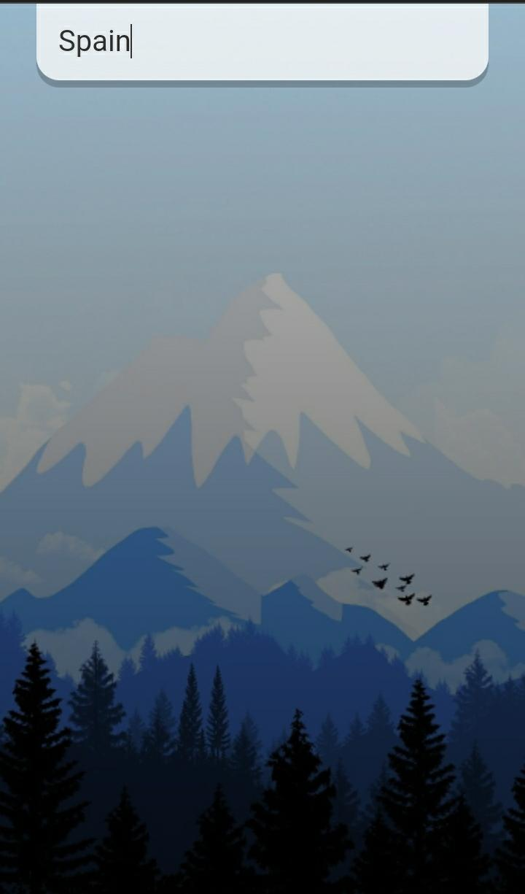
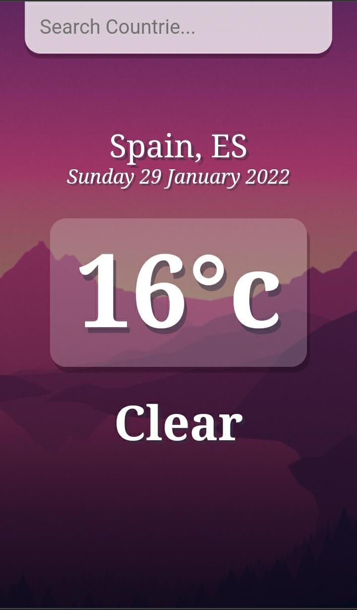
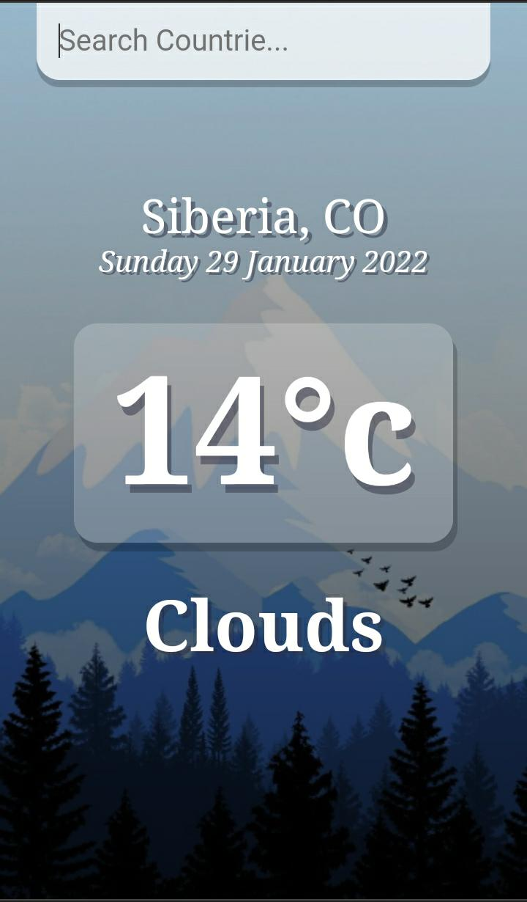
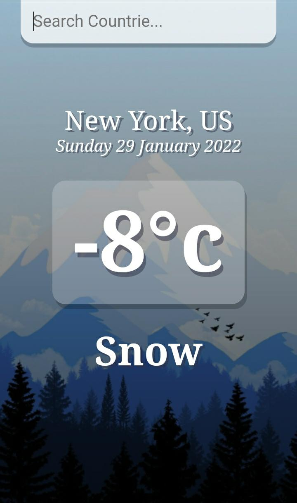

# Weather-App

## [Visitar Web](https://josecossi89.github.io/Weather-App/)

## Descripción

Weather App es una SPA donde se puede visualizar la temperatura actual de paises y cuidades del mundo. En ella se renderiza informacion como:

- Nombre de la ciudad o pais
- Fecha actual
- Temperatura en grados centigrados (°c)
- Estado del clima

Se emplea una API para obtener la informacion que se renderiza.

## Tecnologias usadas

```
React Js
CSS
Gestor de Paquetes YARN
```

---

<h2 align="center" style="color: #9f9f09; font-weight: bold;"> ¡Conozcamos un poco la app! </h2>

---

## _Pantalla Principal_

<p align="center">
  
</p>
<<<<<<< HEAD

## _Busqueda_

=======

## _Busqueda_

> > > > > > > 84e8a5ba5a799484d2a6dcf3c874afdcdb52a531

<p align="center">
  
</p>

## _Busqueda por nombre de paises_

<p align="center">
  
</p>
<p align="center">
  
</p>

## _Busqueda por nombre de cuidades_

<p align="center">
  
</p>
