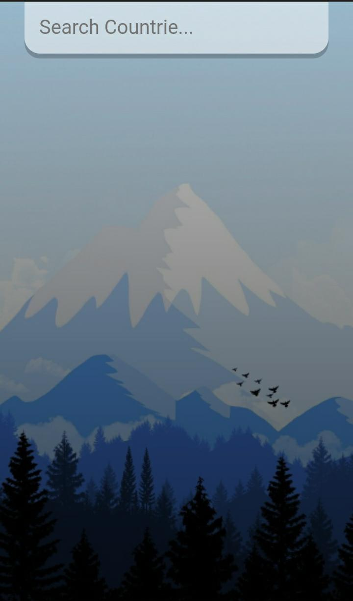

# Weather-App

<<<<<<< HEAD

=======

> > > > > > > acb343bc5b884432bed4a50aac90d46179984cbd

## Descripción

Weather App es una SPA donde se puede visualizar la temperatura actual de paises y cuidades del mundo. En ella se renderiza informacion como:

- Nombre de la ciudad o pais
- Fecha actual
- Temperatura en grados centigrados (°c)
- Estado del clima

## Tecnologias usadas

React Js
CSS
Gestor de Paquetes YARN

---

<h2 align="center" style="color: #9f9f09; font-weight: bold;"> ¡Conozcamos un poco la app! </h2>

---

<<<<<<< HEAD

## _Pantalla Principal_

=======

## _Pantalla Principal_

> > > > > > > acb343bc5b884432bed4a50aac90d46179984cbd

  

